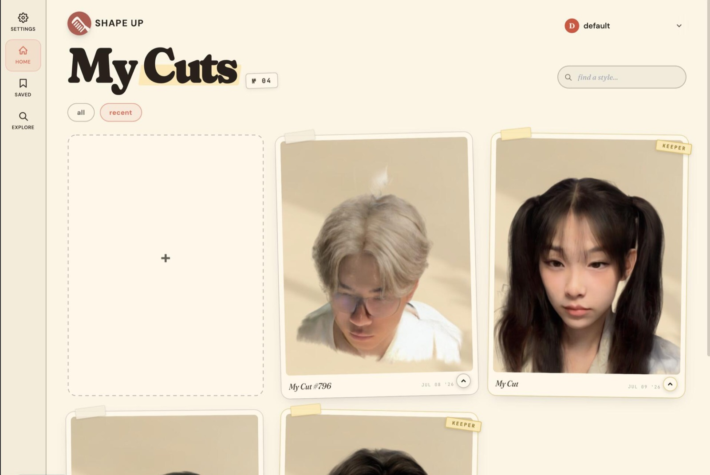

<div align="center">


# ShapeUp

**Try a haircut on your own head in 3D before you sit in the chair.**

[](https://tryshapeup.cc)
[](#quality-checks)
[](#how-it-works)
[](SECURITY.md)

[https://tryshapeup.cc](https://tryshapeup.cc)

</div>



## Overview

A haircut is a decision you cannot undo. That is an awful realization, and one that I (and my friends) have settled upon various times. Today, the most common hair-brainstorming tools consist of asking AI to generate images, using in-app filters, or finding reference images online. Yet all of these have two fundamental issues:

**Invalid constraints** 
Everyone has a different type of hair. Formally, there are 4 types of hair categories, and each one splits up into 12 sub-categories. Functionally, this performs similarly to a personality test -> attempting to condense all of humanity's hair variation into 48 subcategories leaves out much variation, and considering the intricate nature of hairstyling/cutting, this variation matters.

But even more so, all of society's common tools do not even grasp any user's sub-type. Filters simply mold an overlay to their head, and most image generation models bias towards "common" hair --- the wavy brown/blonde hair most readily available for model training. If you're lucky and happen to use the newer ChatGPT Image Generation 2 or any model in the Nano Banana 2 lineup, there is less bias, but albeit still a limited understanding of what your hair type is and is limited to (unless you are white with wavy brown/blonde hair or have fine prompt-engineering skills). 

**Your head is not 2D** 
Unfortunately, we do not have the leisure of being Flat Stanley. Any filter or image, no matter how accurate or inaccurate, is still one angle covering one perspective of our heads. If you brought that reference, it would work, but you'd still have to mention somewhat what  the other angles should look like, ideally. You could also generate snapshots for each major area of your head (front/LHS/RHS/back), but separate snapshots will introduce drift even across our best models and exacerbate issue (#1).

So, we took a stab at both of these problems. ShapeUp takes one selfie, reconstructs the person's head as a 3D Gaussian splat, generates candidate hairstyles onto it, and lets them turn the result around in the browser. Barbers get the same scan translated into a deterministic cutting ticket rather than an incomplete reference or "a vibe".

## How it works

```
┌──────────────────────────────────────────────┐
│  CAPTURE        selfie upload or live scan   │
└──────────────────────┬───────────────────────┘
                       ▼
┌──────────────────────────────────────────────┐
│  BALDIFY        image edit removes the hair  │
└──────────────────────┬───────────────────────┘
                       ▼
┌──────────────────────────────────────────────┐
│  RECONSTRUCT    Gaussian-splat head on a GPU │
└──────────────────────┬───────────────────────┘
                       ▼
┌──────────────────────────────────────────────┐
│  STYLE          hairstyles generated onto it │
└──────────────────────┬───────────────────────┘
                       ▼
┌──────────────────────────────────────────────┐
│  VIEW AND SAVE  3D viewer, projects, tokens  │
└──────────────────────┬───────────────────────┘
                       ▼
┌──────────────────────────────────────────────┐
│  BARBER OUTPUT  measured, deterministic cut  │
└──────────────────────────────────────────────┘
```

Reconstruction takes about 15 to 20 seconds on a GPU worker behind [src/lib/facelift.ts](src/lib/facelift.ts). Due to compute limitations, we run on-demand inference, so your first generation will also be ~20 seconds slower. The barber ticket comes from a feasibility pass that classifies every order before any model call; see [NOTES.md](NOTES.md).

Our pipeline leverages Weijie Lyu's Facelift for 3D reconstruction, with a heavily prompt-engineered Nano Banana 2 generation between edits to prepare valid blueprints equipped with necessary constraints for hair type and style. On our deployed website (https://tryshapeup.cc), we require a Biometric Agreement so we can legally process a selfie and render it. We collect scans, but only for debugging purposes - these scans are automatically deleted if you were to revoke the Biometric Agreement. Lastly, for user convenience, we handle all inference free-of-charge, at the courtesy of AWS/Modal. 

We have uploaded this repository to share the process for anyone who isn't comfortable with data being collected but would love to experiment. Enjoy!

## Installation

```sh
npm install
touch .env.local             # Clerk, Convex, S3, Stripe, Gemini keys and FACELIFT_URL
```

Convex functions live in `convex/`; read `convex/_generated/ai/guidelines.md` before editing them.

## Quick start

```sh
npm run dev                  # http://localhost:3000
npm run facelift             # show or switch the reconstruction upstream (auto | oscar | modal)
```

## Quality checks

```sh
npm run typecheck && npm run lint && npm test   # definition of done
npm run test:e2e                                # Playwright flows
```

Current state on `main`: typecheck clean, 39 Vitest files with 313 tests passing, 4 Playwright specs.

## Limitations

- If cloned, reconstruction requires an external GPU worker and its shared secret; without them the studio cannot create scans.
- Splat quality follows the input photo. Hats, heavy occlusion, and low light degrade the head model.
- Generated hairstyles are previews, not measurements. The barber ticket is derived from measured zones and falls back to deterministic text wherever the model output contradicts them.
- Biometric data handling is described in [COMPLIANCE_NOTES.md](COMPLIANCE_NOTES.md); report issues per [SECURITY.md](SECURITY.md).

## Repository

| Path | Contents |
|---|---|
| `src/app/` | App Router pages: studio, dashboard, barber flow, pricing, admin, API routes |
| `src/components/` | Viewer, capture, booking, dialogs, with colocated tests |
| `convex/` | Backend functions, accounts, tokens, refunds |
| `server/` | GPU workers: reconstruction deployments, baldifier, PLY editing |
| `scripts/` | Upstream switcher, S3 CORS, preview baking |
| `e2e/`, `test/` | Playwright specs and shared fixtures |

## Acknowledgements

Single-image head reconstruction builds on [FaceLift](https://github.com/weijielyu/FaceLift). Rendering uses [three.js](https://threejs.org) and [react-three-fiber](https://github.com/pmndrs/react-three-fiber); the stack is [Next.js](https://nextjs.org), [Convex](https://convex.dev), [Clerk](https://clerk.com), and [Stripe](https://stripe.com). ShapeUp was first built at HackPrinceton as `shapeup-hackprinceton`.
